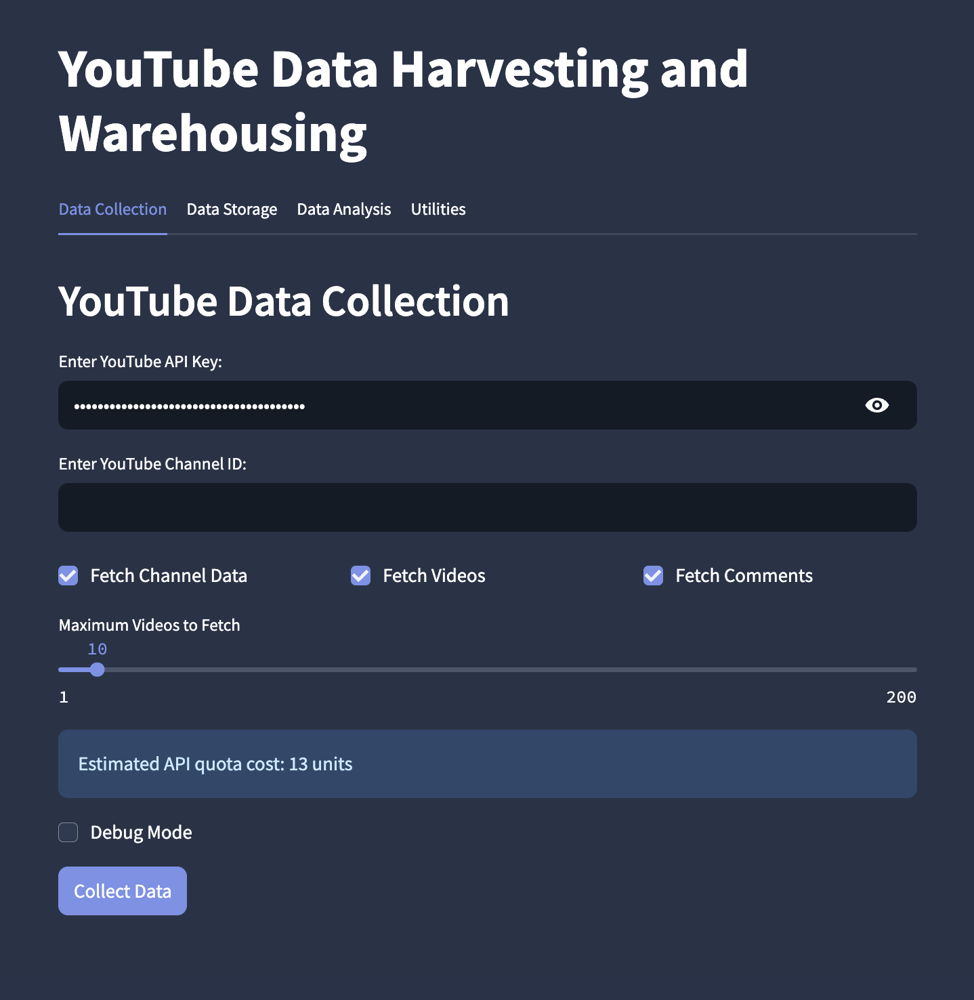

# YTDataHub

# Currently being actively developed and may not work as expected. I will deliver a release version once it is functioning as expected.

A powerful YouTube data collection and analysis tool that helps you gather, store, and analyze channel data, videos, and comments with an intuitive step-by-step workflow.



## Recent Updates (April 2025)

### Enhanced Delta Reporting (April 30, 2025)

- **Comprehensive Change Tracking**: Improved tracking of all metrics changes between data refreshes
- **Hierarchical Delta Display**: Clear visualization of changes at channel, video, and comment levels
- **Percentage Change Calculation**: Automatic calculation of percentage differences for numerical metrics
- **New Content Flagging**: Clear identification of newly added videos and comments
- **Unavailable Content Detection**: Warning indicators when content becomes unavailable
- **DeepDiff Integration**: Advanced diff algorithm provides detailed structural change analysis

### Improved Tab Navigation and UI Styling (April 30, 2025)

- **Enhanced Tab Visibility**: Fixed issues with tab navigation being difficult to see in dark mode
- **Consistent Tab Styling**: Applied consistent styling to all tab interfaces throughout the application
- **Better Dark Mode Support**: Improved contrast and visibility specifically for dark mode users
- **Adaptive Theme Styling**: Added theme-specific styling that works in both light and dark modes
- **Improved Visual Feedback**: Selected tabs now have clear visual distinction with accent color highlighting

### Improved Data Coverage Analysis (April 29, 2025)

- **Enhanced Coverage Calculation**: Fixed issues with data coverage percentages to correctly display when you have 100% of a channel's videos
- **Visual Status Indicators**: Added clear visual indicators (✅, ⚠️, ❌) showing complete, partial, or incomplete data coverage
- **One-Click Updates**: New button to automatically update your data collection to 100% coverage with a single click
- **Last Updated Timestamps**: Added display of when data was last updated (Today, Yesterday, or X days ago)
- **Clear Date Ranges**: Data coverage summary now shows the full date range of collected videos
- **Improved Recommendations**: Smart update recommendations now accurately identify what data is missing

### Enhanced Channel Selection Table (April 28, 2025)

- **Clickable Channel Names**: Channel names now appear as clickable links for convenient single-channel analysis
- **Improved Date Display**: Fixed issues with "Created" and "Last Updated" date columns to properly show formatted dates
- **Enhanced Likes Rate Calculation**: Improved calculation and display of engagement metrics including likes-to-views ratio
- **Streamlined Interface**: Removed redundant channel links for a cleaner, more intuitive user experience
- **Fixed Checkbox Positioning**: Selection checkboxes now appear on the left side of the table for consistent UX
- **Better Visual Styling**: Updated channel links with proper styling and hover effects for better usability

### Improved Channel Table Display

- **Fixed Date Formatting**: The "Created" and "Last Updated" date columns now display in a consistent, readable format
- **Auto-sized Columns**: Table columns automatically adjust their width based on content
- **Enhanced Channel Lookup**: Improved database queries to display accurate channel creation dates
- **Better Number Formatting**: Fixed formatting issues with large numeric values in the table

### Optimized Logging System

- **Reduced Debug Output**: Server logs now show only errors and important issues by default
- **Configurable Log Level**: Added a session state variable to control log verbosity when needed
- **Performance Logging**: Critical performance issues and UI freeze warnings are still captured
- **Improved Error Context**: Error logs now include more context to help with troubleshooting

### How to Use Debug Mode

For troubleshooting, you can enable debug logging by adding this code at the beginning of your application:

```python
st.session_state.debug_mode = True
st.session_state.log_level = logging.DEBUG
```

## Analytics Objectives

YTDataHub is designed with a comprehensive set of analytics objectives to help content creators, marketers, and researchers extract meaningful insights from YouTube data:

### 1. Channel Performance Analysis

- **Comprehensive Overview**: Visualize channel growth and engagement metrics over time
- **Trend Detection**: Identify patterns in views, likes, and comments with customizable trend windows
- **Performance Benchmarking**: Compare current performance against historical data
- **Engagement Ratios**: Analyze likes-to-views and comments-to-views ratios to understand audience behavior
- **Duration Impact Analysis**: Understand how video length correlates with engagement metrics

### 2. Content Coverage Assessment

- **Data Completeness Visualization**: Clearly see what percentage of channel data has been collected
- **Comment Coverage Analysis**: Visualize which videos have comment data and identify collection gaps
- **Temporal Distribution**: Understand the time distribution of collected videos (recent vs. historical)
- **Smart Update Recommendations**: Get actionable suggestions on what data to collect next
- **Background Data Collection**: Update data without interrupting analysis workflows

### 3. Video Performance Deep-Dive

- **Flexible Content Navigation**: Browse, filter, and sort videos with various metrics
- **Multi-Dimensional Analysis**: Examine videos by publication date, view count, engagement, and duration
- **Visual Content Preview**: See video thumbnails alongside performance metrics
- **Metadata Exploration**: Analyze titles, descriptions, tags, and other metadata elements
- **Custom Page Sizing**: Adjust result counts for performance optimization

### 4. Audience Engagement Insights

- **Comment Sentiment Analysis**: Understand audience emotional responses to content
- **Topic Discovery**: Identify common themes and keywords through word clouds
- **Temporal Engagement Patterns**: Track how engagement changes over a video's lifetime
- **Viewer Interaction Analysis**: Explore how different content types drive different engagement levels

These analytics capabilities are continuously being enhanced to provide deeper insights, more visualization options, and greater usability through an intuitive interface.

## Quick Start Guide

1. **Install dependencies**: `pip install -r requirements.txt`
2. **Launch the app**: `streamlit run youtube.py`
3. **Enter your YouTube API key** and a channel ID
4. **Follow the 3-step workflow**:
   - Step 1: Fetch channel information
   - Step 2: Download videos
   - Step 3: Collect comments
5. **Store the data** in SQLite (or other supported databases)
6. **Analyze the data** using the built-in analytics components

## Features

YTDataHub offers a range of features to help you extract and analyze data from YouTube:

### Data Analysis

YTDataHub offers a sophisticated analytics suite with four main components:

#### 1. Analytics Dashboard

- **Performance Metrics**: Track views, likes, comments, and other engagement statistics
- **Time Series Visualization**: Interactive timeline charts showing channel performance over time
- **Configurable Display**: Toggle different metrics on/off to focus on specific aspects of performance
- **Trend Analysis**: Automatic trend line generation with adjustable analysis windows
- **Engagement Ratios**: View likes-to-views and comments-to-views ratios to measure audience interaction

#### 2. Data Coverage Analysis

- **Visual Coverage Indicators**: Color-coded visualizations showing data completeness
- **Comment Collection Status**: See which videos have comment data and which don't
- **Temporal Distribution**: Understand how your collected videos are distributed over time
- **Update Recommendations**: Get smart suggestions for what data to collect next
- **Background Collection Tasks**: Queue and monitor data updates that run in the background

#### 3. Video Explorer

- **Advanced Filtering**: Sort videos by publication date, views, likes, or duration
- **Thumbnail Previews**: Visual representation of each video alongside performance metrics
- **Paginated Results**: Navigate through your video collection with customizable page sizes
- **Metadata Inspection**: Examine titles, descriptions, tags, and other video attributes
- **Performance Comparison**: Easily identify your best and worst performing content

#### 4. Comment Analysis

- **Comment Browser**: Navigate through comments with pagination support
- **Sentiment Analysis**: Understand the emotional tone of audience feedback
- **Word Clouds**: Visualize common topics and themes in your audience's comments
- **Engagement Patterns**: Track how comment activity correlates with video performance
- **Top Commenters**: Identify your most active audience members

### Data Collection

YTDataHub provides a structured approach to collecting YouTube data that ensures you have comprehensive information for analysis:

- **Step-by-step workflow**: Intuitive three-step process (channel → videos → comments) with each step building on the previous
- **Direct "Next Step" Navigation**: Clear guidance on what to do next after completing each step
- **Channel information**: Subscriber count, total views, video count, description, and more
- **Video retrieval**: Fetch any number of videos with options to retrieve all available content
- **Comment collection**: Download comments for each video with customizable limits
- **Flexible sampling**: Adjust how many videos and comments to fetch with options to refetch with different parameters
- **Unavailable content handling**: Clear reporting on private or deleted videos and videos with disabled comments
- **Direct YouTube links**: Easy access to channels, videos, and comments on YouTube
- **Advanced metadata**: Comprehensive data collection including video dimensions, definition, license information, and more
- **Location data support**: Future-ready structure for analyzing video location information
- **Delta reporting**: View detailed changes between data refreshes using DeepDiff to track metrics over time
- **Smart thumbnail handling**: Robust thumbnail URL extraction with multiple fallback options for reliable display
- **Update existing channels**: Compare and refresh data for channels already in your database

### Data Storage & Organization

YTDataHub ensures your valuable YouTube data is properly stored and easily accessible for analysis:

- **Multiple storage options**: Store data in SQLite, local JSON files, MongoDB, or PostgreSQL
- **Enhanced schema**: Comprehensive data model with rich metadata for deeper analysis
- **Automatic backups**: Database backups are created to prevent data loss
- **Flexible retrieval**: Access stored data for further analysis and visualization
- **Channel comparison**: Store data from multiple channels for comparative analysis
- **Modular architecture**: Clean separation of concerns with domain-specific modules
- **Modern data organization**: Structured storage designed for analytical queries
- **Data versioning**: Track changes to channel data over time
- **Metadata enrichment**: Store extended information beyond the basic YouTube API data
- **Efficient storage**: Optimized storage mechanisms to minimize disk usage while maximizing analytical capabilities

### User Interface

YTDataHub features a modern, intuitive interface designed for efficient YouTube data analysis:

- **Channel selector**: Easily view and select channels with sorting and filtering options
- **Analytics dashboard**: Comprehensive visualization of channel performance metrics
- **Data coverage analysis**: Visual indicators of data completeness with enhancement recommendations
- **Video explorer**: Browse and analyze individual video performance
- **Comment analysis**: Explore audience engagement and sentiment
- **Modular interface**: Navigate between different analysis components with a consistent experience
- **Mobile-responsive design**: Access analytics on various devices
- **Customizable displays**: Toggle chart visibility and adjust visualization parameters
- **Sidebar controls**: Quick access to common functions and settings
- **Configurable preferences**: Personalize your analytics experience
- **Performance optimization**: Fast rendering and data processing for large datasets

## Using YTDataHub: Step-by-Step Guide

### 1. Data Collection

#### Step 1: Channel Information

- Enter your YouTube API key and a channel ID or URL
- Click "Fetch Channel Data" to retrieve basic channel information
- Review channel statistics before proceeding
- For existing channels, you'll see a delta report showing changes since the last update

#### Step 2: Video Data

- Choose how many videos to download (or select "Fetch All Videos")
- Click "Fetch Videos" to download video information
- Videos are immediately displayed with thumbnails, views, likes, and comment counts
- Sort videos by recency, views, likes, or comment count
- When updating existing channels, a detailed comparison will show new videos and metric changes

#### Step 3: Comments Data

- Select how many comments to fetch per video (up to 100, or skip by setting to 0)
- Click "Fetch Comments" to download comment content
- After comments are fetched, a summary will show key statistics
- Click the "Go to Data Storage Tab" button to proceed to the next step

### 2. Data Storage

- Select a storage option (SQLite is recommended for beginners)
- Name your dataset
- Click "Save Data" to store the collected information
- A confirmation message will appear upon successful storage

### 3. Data Analysis

Once you've collected and stored your YouTube data, the analysis tab offers powerful insights through four main components:

#### Using the Analytics Dashboard

- Select one or more channels to analyze from the channel selector at the top
- Navigate to the Dashboard section from the sidebar
- Toggle different charts on/off using the sidebar controls:
  - Views Chart: Track view count trends over time
  - Likes Chart: Analyze audience approval
  - Comments Chart: Monitor audience engagement
  - Duration Chart: See how video length affects performance
- Enable trend lines to identify growth patterns and performance trajectories
- Adjust the trend window (Small, Medium, Large) to analyze short or long-term patterns

#### Analyzing Data Coverage

- Navigate to the Data Coverage section from the sidebar
- View the completeness of your data collection through color-coded visualizations:
  - Video Coverage: Percentage of channel videos you've collected
  - Comment Coverage: Percentage of videos with comment data
- Use the stacked bar chart to see the distribution of videos with comments, videos without comments, and uncollected videos
- Check the heatmap for a quick overview of coverage gaps
- Update your data collection based on recommendations:
  - Select a channel to update
  - Choose what content to update (channel info, videos, comments)
  - Set collection parameters (videos to collect, comments per video)
  - Start a background update process

#### Exploring Videos

- Navigate to the Videos section from the sidebar
- Adjust display options in the sidebar:
  - Results per page: Control how many videos are shown at once
  - Thumbnail display: Toggle video thumbnails on/off
  - Sort order: Arrange by publish date, views, likes, or duration
- Browse through videos with pagination controls
- Examine detailed metrics for each video including:
  - View count, like count, comment count
  - Engagement ratios
  - Publication date and duration

#### Analyzing Comments

- Navigate to the Comments section from the sidebar
- Configure display options:
  - Comments per page: Adjust how many comments are shown
  - Sentiment Analysis: Enable/disable sentiment visualization
  - Word Clouds: Toggle topic visualization on/off
- Browse through comments with pagination controls
- Identify common themes and sentiments in audience feedback
- Discover your most engaged viewers and their feedback patterns

## Delta Reporting

YTDataHub includes a robust delta reporting system that tracks and visualizes changes between data collection sessions. This feature is particularly valuable for understanding channel growth and content performance over time.

### How Delta Reporting Works

When updating an existing channel in the database, YTDataHub:

1. Loads the previously stored data as a baseline
2. Fetches fresh data from the YouTube API
3. Performs a deep comparison between the datasets using DeepDiff
4. Generates a user-friendly report showing exactly what has changed

### Channel-Level Delta Tracking

- **Subscriber Growth**: Track increases or decreases in subscriber count with percentage changes
- **View Accumulation**: Monitor total view count changes across the channel
- **Video Count Changes**: See when new videos are published or when videos become unavailable
- **Description Updates**: Compare changes in channel descriptions and metadata

### Video-Level Delta Tracking

- **View Increases**: Monitor view count growth for individual videos
- **Engagement Changes**: Track likes and comments metrics with percentage changes
- **New Video Detection**: Clearly identify newly published videos since last update
- **Metadata Modifications**: See changes in video titles, descriptions, or other attributes

### Comment-Level Delta Tracking

- **New Comment Counting**: Track how many new comments each video receives
- **Comment Availability**: Detect when comments become unavailable or are removed
- **Engagement Growth**: Measure increasing engagement through comment interactions

### Technical Implementation

The delta reporting feature is powered by:

- **DeepDiff Library**: Performs sophisticated structural comparisons between datasets
- **Channel Collection Logic**: Preserves original values before updates for comparison
- **Video Collection Process**: Creates mappings of existing video data for comparison
- **Comment Collection Process**: Tracks existing comments for detecting new additions

## Complete Project Structure

YTDataHub follows a modular architecture with clear separation of concerns:

### Entry Points

- `youtube.py` - Main application entry point that initializes Streamlit and configures the application
- `setup.py` - Package installation script for setting up YTDataHub as a Python package

### Core Application

- `src/app.py` - Main application setup, page routing, and session state management
- `src/config.py` - Configuration settings, environment variable handling, and application constants
- `src/__init__.py` - Package initialization and version information

### Analysis Layer

- `src/analysis/` - Data analysis modules
  - `base_analyzer.py` - Abstract base class with common analysis utilities and helper methods
  - `channel_analyzer.py` - Processes and analyzes channel-level statistics and growth metrics
  - `video_analyzer.py` - Handles video data processing, statistical analysis, and content patterns
  - `comment_analyzer.py` - Processes comment text, sentiment, engagement analysis, and temporal patterns
  - `youtube_analysis.py` - Facade providing backward compatibility with legacy code
  - `visualization/` - Chart generation utilities
    - `__init__.py` - Package initialization for visualization components
    - `trend_line.py` - Statistical trend line generation and time series analysis tools
    - `chart_helpers.py` - Reusable chart configuration functions and layout standardization

### Data Access

- `src/api/` - API client implementations
  - `__init__.py` - Package initialization for API components
  - `youtube_api.py` - Main YouTube Data API client wrapper for backward compatibility
  - `youtube/` - Modular YouTube API clients
    - `__init__.py` - Package initialization exposing the unified API
    - `base.py` - Base API client with common functionality
    - `channel.py` - Channel-specific API operations
    - `video.py` - Video-specific API operations
    - `comment.py` - Comment-specific API operations
    - `resolver.py` - Channel URL and handle resolution
- `src/database/` - Database abstraction and operations
  - `__init__.py` - Package initialization for database components
  - `sqlite.py` - SQLite database operations, schema management, and query functions
  - `migrate_schema.py` - Schema migration utilities
- `src/models/` - Data models and object representations
  - `__init__.py` - Package initialization for data models
  - `youtube.py` - Enhanced data models for YouTube entities (channels, videos, comments, locations)
- `src/services/` - Service layer coordinating business logic
  - `youtube_service.py` - Service layer coordinating API and storage operations
- `src/storage/` - Data persistence implementations
  - `__init__.py` - Package initialization for storage components
  - `factory.py` - Factory pattern for storage backend selection and initialization
  - `local_storage.py` - File-based storage implementation for JSON data

### User Interface

- `src/ui/` - UI components for each application section
  - `__init__.py` - Package initialization for UI components
  - `data_collection.py` - Data collection workflow UI with step-by-step guidance
  - `data_storage.py` - Data persistence interface and storage options configuration
  - `data_analysis.py` - Analytics dashboard and visualization interface
  - `utilities.py` - Settings, configuration UI, and debugging tools
  - `components/` - Reusable UI components and widgets
    - `channel_card.py` - Displays channel metadata in card format
    - `video_list.py` - Renders paginated video galleries with filtering options
    - `comment_display.py` - Renders comment threads with collapsible replies
    - `metrics_panel.py` - Shows key performance metrics with trend indicators
    - `navigation.py` - Step navigation and workflow guidance components
  - `data_analysis/` - Specialized analytics UI components
    - `main.py` - Entry point for analytics dashboard
    - `channel_insights.py` - Channel growth and performance visualizations
    - `video_performance.py` - Video metrics and engagement analytics
    - `comment_analysis.py` - Comment sentiment and engagement analysis
    - `trend_visualization.py` - Time-series trend visualization components

### Static Assets

- `src/static/` - Static assets for UI rendering
  - `css/` - Stylesheets for UI components
    - `dashboard.css` - Styles for analytics dashboard
    - `styles.css` - Global application styles
  - `templates/` - HTML templates for UI components
    - `analytics_dashboard_styles.html` - Styles for analytics dashboard
    - `analytics_dashboard.html` - Main dashboard template
    - `channel_info.html` - Channel information display template
    - `data_collection_summary.html` - Summary template for collection results
    - `duration_chart.html` - Video duration chart template
    - `duration_metrics.html` - Duration metrics display template
    - `engagement_metrics.html` - Engagement analysis template
    - `engagement_timeline_chart.html` - Timeline chart for engagement metrics
    - `security_headers.html` - Security headers template
    - `storage_options_info.html` - Information about storage options
    - `storage_options.html` - Storage configuration template
    - `video_item.html` - Template for individual video display

### Utilities

- `src/utils/` - Common utility functions
  - `__init__.py` - Package initialization for utilities
  - `helpers.py` - Common utility functions used across the application
  - `background_tasks.py` - Background task management and execution

### Data Storage

- `data/` - Default data storage location
  - `youtube_data.db` - Default SQLite database file for data storage
  - `youtube_data.db_*.bak` - Backup files for the database

### Documentation

- `documentation/` - Detailed documentation files
  - `api-implementation-guide.md` - Guide for implementing a REST API
  - `architecture.md` - Detailed architecture documentation
  - `data-analysis-options.png` - Screenshot of analysis options
  - `data-analysis.png` - Data analysis feature diagram
  - `data-storage.png` - Data storage options diagram
  - `database-operations.md` - Database operations documentation
  - `homepage.png` - Application homepage screenshot
  - `old-to-new-schema.md` - Documentation of database schema evolution
  - `utilities.png` - Utilities and settings screenshot
  - `youtube-api-quota-md.md` - YouTube API quota information
  - `youtube-channel-api-quota-md.md` - Channel API quota details
  - `youtube-video-api-quota-md.md` - Video API quota details
  - `delta-reporting.md` - Documentation on delta reporting functionality

### Package Information

- `ytdatahub.egg-info/` - Package installation metadata
  - `dependency_links.txt` - Package dependency information
  - `PKG-INFO` - Package metadata
  - `SOURCES.txt` - Source file listing
  - `top_level.txt` - Top-level package information

## Detailed Documentation

For more detailed information about the application, please refer to the documentation folder:

- [Architecture Documentation](documentation/architecture.md) - Detailed explanation of the application architecture
- [API Implementation Guide](documentation/api-implementation-guide.md) - Guide for implementing a REST API
- [YouTube API Quota Information](documentation/youtube-api-quota-md.md) - Information about YouTube API quotas
- [Database Schema Evolution](documentation/old-to-new-schema.md) - Information about the database schema changes
- [Database Operations](documentation/database-operations.md) - Documentation on database operations
- [Delta Reporting](documentation/delta-reporting.md) - Information about tracking changes between data collections

## Key Technical Improvements

### Enhanced Database Schema

The YTDataHub database schema has been significantly enhanced to store more comprehensive data:

- **Channels**: Additional fields for custom URL, country, language, privacy settings, thumbnail URLs at different resolutions
- **Videos**: Extended metadata including dislike/favorite counts, dimension (2D/3D), definition (SD/HD), license information, privacy settings
- **Comments**: Improved structure with parent-child relationships for threaded comments, like counts, and author information
- **Video Locations**: New table supporting future location-based analysis of video content

### Modular YouTube API Client

The YouTube API client has been refactored into specialized components:

- **Base Client**: Common functionality for initialization, caching, and error handling
- **Channel Client**: Specialized operations for channel data retrieval
- **Video Client**: Focused on video listing and metadata fetching
- **Comment Client**: Optimized for comment retrieval and threading
- **Channel Resolver**: Specialized component for resolving custom URLs and handles

This architecture improves maintainability, testability, and separation of concerns while maintaining backward compatibility.

## Setup and Installation

### Prerequisites

1. **Python 3.8+** - Ensure you have Python 3.8 or later installed
2. **Google Cloud Account** - Required for accessing the YouTube Data API
3. **YouTube Data API Key** - Needed to retrieve data from YouTube

### Step 1: Clone the Repository

```bash
git clone https://github.com/yourusername/ytdatahub.git
cd ytdatahub
```

### Step 2: Create a Virtual Environment (Recommended)

```bash
# For macOS/Linux
python3 -m venv venv
source venv/bin/activate

# For Windows
python -m venv venv
venv\Scripts\activate
```

### Step 3: Install Dependencies

```bash
pip install -r requirements.txt
```

### Step 4: Set Up YouTube API Key

1. Visit the [Google Cloud Console](https://console.cloud.google.com/)
2. Create a new project or select an existing one
3. Enable the "YouTube Data API v3" for your project
4. Create API credentials:
   - Go to "APIs & Services" > "Credentials"
   - Click "Create Credentials" > "API Key"
   - Copy your API key

You can set up your API key in one of two ways:

- Create a `.env` file in the project root and add: `YOUTUBE_API_KEY=your_api_key_here`
- Or enter it directly in the application interface when prompted

### Step 5: Launch the Application

```bash
streamlit run youtube.py
```

The application should open in your default web browser at `http://localhost:8501`.

## Troubleshooting

If you encounter any issues:

1. Check that your API key is correct and has the necessary permissions
2. Ensure you've properly configured any database connections
3. Look for any error messages in the application interface
4. Enable "Debug Mode" in the application for more detailed logs

## License

The YTDataHub is released under the MIT License. Feel free to modify and use the code according to the terms of the license.

---

For more details about the project architecture, technical implementation, and future plans, see [Architecture Documentation](documentation/architecture.md).
