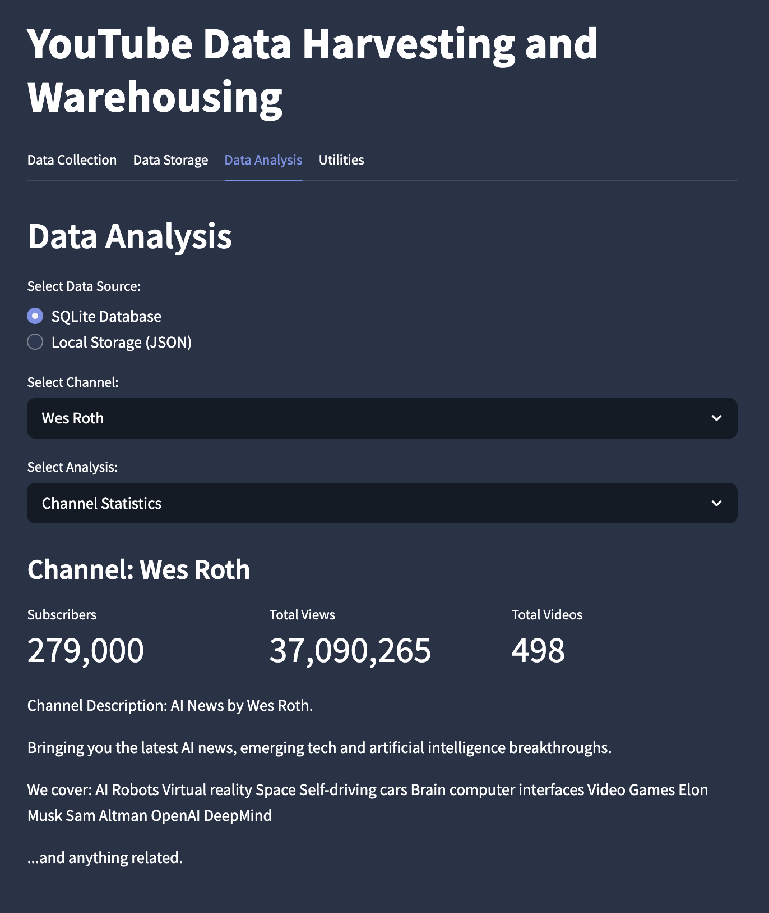

# YTDataHub Project

## Content

[Introduction](#Introduction)

[Features](#Features)

[Technologies Used](#Technologies-Used)

[Setup and Installation](#Setup-and-Installation)

[Project Structure](#Project-Structure)

[Process Flow](#Process-Flow)

[Application Flow](#Application-Flow)

[Additional Information](#Additional-Information)

[License](#License)

[Conclusion](#Conclusion)

## Introduction

This project is a YouTube data hub that allows users to retrieve, store, and analyze data from YouTube channels. It utilizes the YouTube Data API to fetch information such as channel statistics, video details, and comments. The application provides a clean, modular architecture with various storage options and data analysis capabilities.





## Features

YTDataHub offers a range of features to help you extract and analyze data from YouTube. Some of the key features include:

**`Retrieve channel statistics:`**
Get detailed information about YouTube channels, including subscriber count, view count, video count, and other relevant metrics.

**`Fetch video details:`**
Extract data such as video title, description, duration, view count, like count, and publish date for individual videos.

**`Analyze comments:`**
Retrieve comments made on YouTube videos and perform analysis, such as sentiment analysis or comment sentiment distribution.

**`Generate reports:`**
Generate reports and visualizations based on the collected data, allowing users to gain insights into channel performance, video engagement, and audience interaction.

**`Multiple storage options:`**
Store the collected YouTube data in SQLite, local JSON files, MongoDB, or PostgreSQL based on your preference and requirements.

**`Data visualization:`**
View your data through interactive charts and graphs to better understand trends and patterns.

**`Modular architecture:`**
Easily extensible codebase with clear separation of concerns between API interaction, data modeling, storage, and presentation.

## Technologies Used

**`Python:`** The project is implemented using the Python programming language.

**`YouTube Data API:`** Utilizes the official YouTube Data API to interact with YouTube's platform and retrieve data.

**`Streamlit:`** The user interface and visualization are created using the Streamlit framework, providing a seamless and interactive experience.

**`SQLite:`** A lightweight, file-based relational database that serves as the default storage option, requiring no additional setup.

**`MongoDB (Optional):`** Support for storing data in MongoDB for more scalable and flexible document-based storage.

**`PostgreSQL (Optional):`** Support for storing data in PostgreSQL for more robust relational database capabilities.

**`Pandas:`** Used for data manipulation, analysis, and visualization, making it easy to process and explore the collected data.

**`Matplotlib:`** Enables the creation of various charts and visualizations to represent the YouTube data graphically.

**`Google API Client:`** The official Google API client library for Python is used to interact with the YouTube Data API.

## Setup and Installation

Follow these steps to set up and run YTDataHub on your local machine after cloning the repository:

### Prerequisites

1. **Python 3.8+** - Ensure you have Python 3.8 or later installed
2. **Google Cloud Account** - Required for accessing the YouTube Data API
3. **YouTube Data API Key** - Needed to retrieve data from YouTube

### Step 1: Clone the Repository

```bash
git clone https://github.com/yourusername/rtb-v8.git
cd rtb-v8
```

### Step 2: Create a Virtual Environment (Recommended)

```bash
# For macOS/Linux
python3 -m venv venv
source venv/bin/activate

# For Windows
python -m venv venv
venv\Scripts\activate
```

### Step 3: Install Dependencies

```bash
pip install -r requirements.txt
```

### Step 4: Set Up YouTube API Key

1. Visit the [Google Cloud Console](https://console.cloud.google.com/)
2. Create a new project or select an existing one
3. Enable the "YouTube Data API v3" for your project
4. Create API credentials:
   - Go to "APIs & Services" > "Credentials"
   - Click "Create Credentials" > "API Key"
   - Copy your API key

You can set up your API key in one of two ways:

- Create a `.env` file in the project root and add: `YOUTUBE_API_KEY=your_api_key_here`
- Or enter it directly in the application interface when prompted

### Step 5: Database Setup (Optional)

By default, the application uses SQLite and local JSON storage, which requires no additional setup.

For optional database storage:

**MongoDB:**

1. Install MongoDB on your system or use MongoDB Atlas
2. Add the following to your `.env` file:
   ```
   MONGO_URI=your_mongodb_connection_string
   ```

**PostgreSQL:**

1. Install PostgreSQL on your system
2. Add the following to your `.env` file:
   ```
   PG_HOST=localhost
   PG_USER=your_pg_username
   PG_PASSWORD=your_pg_password
   PG_DATABASE=your_pg_database
   PG_PORT=5432
   ```

### Step 6: Launch the Application

```bash
streamlit run youtube.py
```

The application should open in your default web browser at `http://localhost:8501`.

### Step 7: Use the Application

1. Enter your YouTube API key (if not set in the `.env` file)
2. Enter a YouTube channel ID (e.g., "UCnz-ZXXER4jOvuED5trXfEA")
3. Configure your data fetch options
4. Click "Collect Data" to start retrieving data
5. Navigate to the "Data Storage" tab to save your data
6. Use the "Data Analysis" tab to analyze the collected data

### Troubleshooting

If you encounter any issues:

1. Check that your API key is correct and has the necessary permissions
2. Ensure you've properly configured any database connections
3. Look for any error messages in the application interface
4. Enable "Debug Mode" in the application for more detailed logs

## Project Structure

The project follows a modular architecture with clear separation of concerns:

```
src/
├── api/              # API client implementation
│   └── youtube_api.py  # YouTube Data API interaction
├── database/         # Database connectors
│   ├── sqlite.py     # SQLite database implementation
│   ├── mongodb.py    # MongoDB implementation (optional)
│   └── postgres.py   # PostgreSQL implementation (optional)
├── models/           # Data models
│   └── youtube.py    # Data classes for channel, video, and comment data
├── storage/          # Storage implementations
│   └── local_storage.py  # Local JSON file storage
├── ui/               # UI components (to be expanded)
└── utils/            # Utility functions
    └── helpers.py    # Helper functions for the application
```

This structure allows for easy extension and maintenance, with each component having a specific responsibility.

## Process Flow

### Obtain YouTube API credentials:

> Visit the `Google Cloud Console`.

> Create a new project or select an existing project.

> Enable the `YouTube Data API v3` for your project.

> Create `API credentials` for youtube API v3.

### ETL Process

> `Extracting` data from YouTube API.

> `Transforming` data into structured format using data models.

> `Loading` data into your chosen storage backend (SQLite, JSON, MongoDB, or PostgreSQL).

## Application Flow

1. **Data Collection**:

   - Enter your YouTube API key and a channel ID
   - Configure data fetch options (channel info, videos, comments)
   - Click on "Collect Data" to retrieve data from YouTube

2. **Data Storage**:

   - Choose from multiple storage options (SQLite, Local Storage, MongoDB, PostgreSQL)
   - Save the collected data to your preferred storage solution

3. **Data Analysis**:

   - Select a data source and channel to analyze
   - Choose from various analysis options:
     - Channel Statistics
     - Video Statistics
     - Top 10 Most Viewed Videos
     - Video Publication Over Time
     - Video Duration Analysis
     - Comment Analysis

4. **Utilities**:
   - Manage cache and optimize performance
   - Clear API cache, Python cache, and database cache

## Additional Information

- The application respects YouTube API quota limits and provides an estimation of quota usage before making API calls.
- Debug mode is available for troubleshooting and development purposes.
- The project uses `__init__.py` files to maintain proper Python package structure, enabling clean imports.
- When using this application, ensure you comply with the YouTube Data API's terms of service.

## License

The YouTube Data Scraper is released under the MIT License. Feel free to modify and use the code according to the terms of the license.

## Conclusion

This YouTube data scraper project provides a comprehensive tool for retrieving, storing, analyzing, and visualizing YouTube data. The modular architecture makes it easy to extend and maintain, while the multiple storage options give you flexibility in how you work with the data.

## Future Implementations

While YTDataHub already provides strong functionality for YouTube data collection and analysis, the following features are planned for future implementation:

1. **MongoDB and PostgreSQL Support**:

   - Complete the implementation of MongoDB and PostgreSQL database connectors
   - Add comprehensive documentation for setting up and configuring these databases
   - Implement data migration tools between different storage backends

2. **Comment Sentiment Analysis**:

   - Implement natural language processing to analyze comment sentiment
   - Add visualization of sentiment distribution across videos
   - Track sentiment trends over time for channels

3. **Enhanced UI Components**:

   - Develop reusable UI components in the `src/ui/` directory
   - Create a more interactive dashboard with custom widgets
   - Implement a dark mode option for the Streamlit interface

4. **API Usage Optimization**:

   - Improve caching mechanisms to minimize YouTube API quota usage
   - Implement scheduled data fetching to automatically update channel information
   - Add batch processing for more efficient handling of large channels

5. **Export Functionality**:
   - Allow users to export analysis results in various formats (CSV, Excel, PDF)
   - Create shareable report links for collaborative analysis
   - Implement automated reporting with customizable templates

These planned features will enhance the application's capabilities and provide users with more options for data analysis and visualization. The modular architecture of YTDataHub makes it easy to implement these features incrementally.

_Note: This section will be updated as features are implemented and new plans are developed._
