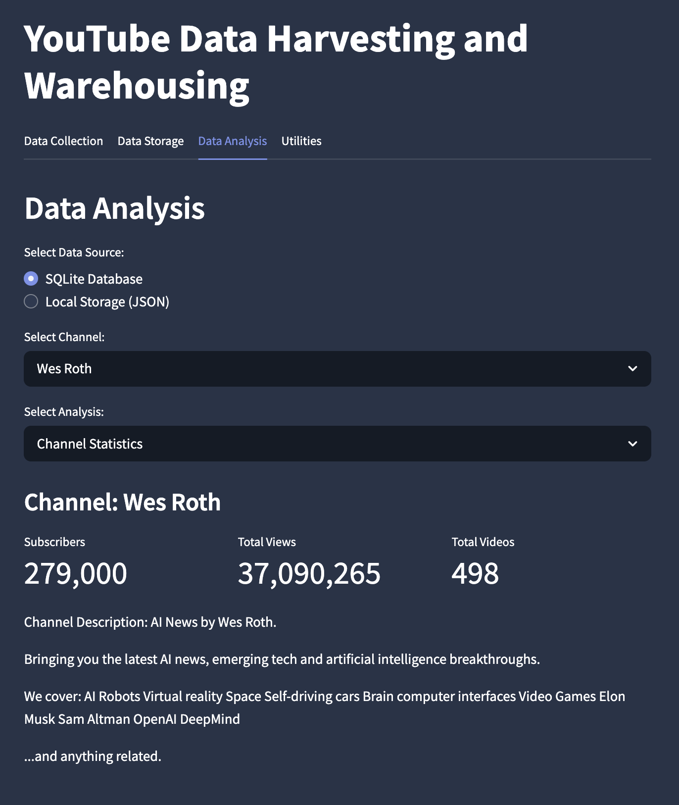

# YTDataHub Architecture Documentation

This document provides a comprehensive overview of the YTDataHub architecture, explaining how the various components work together and the design principles that guided the implementation.

## System Architecture Overview

YTDataHub follows a modular, layered architecture with clear separation of concerns:



### Core Architecture Layers

1. **Presentation Layer (UI)** - Streamlit-based user interface components
2. **Service Layer** - Business logic, workflow coordination, and data transformation
3. **Data Access Layer** - API clients and storage implementations
4. **Utility Layer** - Helper functions and shared utilities

## Detailed Component Breakdown

### 1. Entry Points

- **youtube.py**: Main application entry point that initializes Streamlit and configures the application. This serves as the primary interface for users running the application locally.
- **setup.py**: Package installation script that allows YTDataHub to be installed as a Python package with pip.

### 2. Core Application Components

- **src/app.py**: Core application setup responsible for:
  - Initializing Streamlit application
  - Managing page routing logic
  - Setting up session state for persistent data
  - Configuring application settings
- **src/config.py**: Configuration management handling:
  - Environment variable loading
  - Application constants
  - Default configuration values
  - Configuration validation

### 3. Analysis Layer

The analysis layer is responsible for processing and analyzing data collected from YouTube. It is organized into specialized analyzers for different data types:

#### Base Components

- **src/analysis/base_analyzer.py**: Abstract base class that provides:
  - Common calculation methods
  - Standardized result formatting
  - Error handling for analysis operations
  - Statistical utility functions

#### Specialized Analyzers

- **src/analysis/channel_analyzer.py**: Processes channel-level metrics including:

  - Subscriber growth trends
  - View-to-subscriber ratios
  - Upload frequency analysis
  - Channel performance over time

- **src/analysis/video_analyzer.py**: Handles video-specific analysis:

  - View count distributions
  - Like-to-view ratio calculations
  - Publication pattern detection
  - Video duration analysis
  - Trending metrics identification

- **src/analysis/comment_analyzer.py**: Performs comment processing:

  - Comment volume tracking
  - Comment sentiment analysis
  - User engagement patterns
  - Temporal distribution of comments
  - Comment-to-view ratio calculations

- **src/analysis/youtube_analysis.py**: Facade pattern implementation that:
  - Provides backward compatibility with legacy code
  - Routes requests to appropriate specialized analyzers
  - Standardizes result formats across analyzers

#### Visualization Components

- **src/analysis/visualization/**: Contains specialized visualization logic:
  - **trend_line.py**: Generates statistical trend lines and time series
  - **chart_helpers.py**: Provides reusable chart configuration utilities

### 4. Data Access Layer

#### API Clients

- **src/api/youtube_api.py**: YouTube Data API client with:
  - Quota management and tracking
  - Caching for response data
  - Automatic retries for transient failures
  - Error handling and reporting
  - Pagination for large result sets

#### Database Operations

- **src/database/sqlite.py**: SQLite implementation with:
  - Schema creation and management
  - CRUD operations for all entity types
  - Query optimization
  - Migration handling

#### Data Models

- **src/models/youtube.py**: Type-safe representations of:
  - Channel information
  - Video metadata
  - Comment data
  - Relationships between entities

#### Service Coordination

- **src/services/youtube_service.py**: Orchestration layer that:
  - Coordinates API requests
  - Manages data flow between components
  - Implements business logic
  - Handles error conditions
  - Provides consistent interfaces for UI components

#### Storage Implementations

- **src/storage/factory.py**: Factory pattern implementation that:

  - Creates appropriate storage backends
  - Abstracts storage implementation details
  - Provides consistent interface regardless of backend

- **src/storage/local_storage.py**: File-based storage implementation:
  - JSON serialization and deserialization
  - File system operations
  - Data integrity verification

### 5. User Interface Components

#### Main UI Modules

- **src/ui/data_collection.py**: Implements the data collection workflow:

  - Step-by-step guidance through collection process
  - Input validation and error handling
  - Progress tracking and reporting
  - Result summaries and visualizations

- **src/ui/data_storage.py**: Storage configuration interface:

  - Storage backend selection
  - Configuration options for each backend
  - Dataset naming and versioning
  - Storage status reporting

- **src/ui/data_analysis.py**: Legacy analysis interface:

  - Maintains backward compatibility
  - Routes to newer analysis components
  - Provides fallback functionality

- **src/ui/utilities.py**: Settings and utility functions:
  - Application configuration interface
  - Debug and logging options
  - API key management
  - Cache control

#### Specialized UI Components

- **src/ui/components/**: Reusable UI widgets and components

  - **channel_card.py**: Displays channel metadata in card format
  - **video_list.py**: Renders paginated video galleries with filtering options
  - **comment_display.py**: Renders comment threads with collapsible replies
  - **metrics_panel.py**: Shows key performance metrics with trend indicators
  - **navigation.py**: Step navigation and workflow guidance components

- **src/ui/data_analysis/**: Refactored analysis UI components with specialized visualizations
  - **main.py**: Entry point for analytics dashboard
  - **channel_insights.py**: Channel growth and performance visualizations
  - **video_performance.py**: Video metrics and engagement analytics
  - **comment_analysis.py**: Comment sentiment and engagement analysis
  - **trend_visualization.py**: Time-series trend visualization components

### 6. Static Assets

- **src/static/css/**: Stylesheet definitions:

  - **dashboard.css**: Analytics dashboard styling
  - **styles.css**: Global application styles

- **src/static/templates/**: HTML templates for UI components:
  - Dashboard layouts
  - Chart containers
  - Data display components
  - Information cards

### 7. Utility Functions

- **src/utils/helpers.py**: Cross-cutting utility functions:
  - Date formatting
  - Text processing
  - Data validation
  - URL handling

## Data Flow

The application follows a clear data flow pattern:

1. **User Input** → Collected through Streamlit UI components
2. **Service Layer** → Processes requests and coordinates operations
3. **API Client** → Fetches data from YouTube API
4. **Data Processing** → Transforms and organizes raw API data
5. **Storage Layer** → Persists data to selected storage backend
6. **Analysis Layer** → Processes stored data for insights
7. **Visualization** → Presents results through charts and reports
8. **UI Presentation** → Displays visualizations and insights to user

## Key Design Patterns

YTDataHub implements several design patterns to ensure maintainability and extensibility:

### 1. Factory Pattern

Used in storage implementations to abstract the creation of different storage backends.

```python
# Usage example from storage/factory.py
def create_storage(storage_type):
    if storage_type == 'sqlite':
        return SQLiteStorage()
    elif storage_type == 'json':
        return LocalJSONStorage()
    # Additional storage types...
```

### 2. Facade Pattern

The `youtube_analysis.py` module implements a facade pattern to simplify interactions with various analysis components:

```python
# Conceptual example of facade pattern
def analyze_channel(channel_data, videos_data):
    channel_stats = channel_analyzer.analyze(channel_data)
    video_stats = video_analyzer.analyze_collection(videos_data)
    return {
        "channel": channel_stats,
        "videos": video_stats,
        "combined_insights": derive_insights(channel_stats, video_stats)
    }
```

### 3. Strategy Pattern

Applied in the analyzer components to allow different analysis strategies based on data availability and user requirements:

```python
# Conceptual example of strategy pattern
class VideoAnalyzer:
    def analyze(self, videos, strategy='full'):
        if strategy == 'quick':
            return self._perform_quick_analysis(videos)
        elif strategy == 'full':
            return self._perform_detailed_analysis(videos)
        elif strategy == 'trending':
            return self._analyze_trending_patterns(videos)
```

### 4. Observer Pattern

Implemented in the UI to update components when data changes:

```python
# Conceptual example of observer pattern in Streamlit
def on_data_change():
    st.session_state.needs_update = True

# When data changes
if st.session_state.needs_update:
    refresh_all_charts()
    st.session_state.needs_update = False
```

## Database Schema

YTDataHub uses a relational database schema (primarily SQLite) with the following structure:

### Channels Table

```sql
CREATE TABLE IF NOT EXISTS channels (
    channel_id TEXT PRIMARY KEY,
    title TEXT,
    description TEXT,
    published_at TEXT,
    view_count INTEGER,
    subscriber_count INTEGER,
    video_count INTEGER,
    last_updated TEXT
);
```

### Videos Table

```sql
CREATE TABLE IF NOT EXISTS videos (
    video_id TEXT PRIMARY KEY,
    channel_id TEXT,
    title TEXT,
    description TEXT,
    published_at TEXT,
    view_count INTEGER,
    like_count INTEGER,
    comment_count INTEGER,
    duration TEXT,
    thumbnail_url TEXT,
    last_updated TEXT,
    FOREIGN KEY (channel_id) REFERENCES channels (channel_id)
);
```

### Comments Table

```sql
CREATE TABLE IF NOT EXISTS comments (
    comment_id TEXT PRIMARY KEY,
    video_id TEXT,
    author TEXT,
    text TEXT,
    like_count INTEGER,
    published_at TEXT,
    last_updated TEXT,
    FOREIGN KEY (video_id) REFERENCES videos (video_id)
);
```

## API Usage and Quotas

YTDataHub carefully manages YouTube API quota usage to prevent exceeding limits:

### Quota Costs

- Channel info: 1 unit per request
- Video listing: 1 unit per request (returns up to 50 videos per request)
- Video details: 1 unit per video
- Comments: 1 unit per request (returns up to 100 comments per request)

### Quota Management Strategy

- **Estimations**: Pre-calculate quota usage before making requests
- **Caching**: Store API responses to minimize repeat requests
- **Batching**: Combine requests where possible to reduce quota usage
- **Pagination Control**: Allow users to limit data collection by page
- **Request Optimization**: Fetch only necessary fields in API requests

## Error Handling

The application implements a robust error handling strategy:

1. **API-Specific Errors**:

   - Quota exceeded handling
   - Rate limiting detection and backoff
   - Invalid parameter errors

2. **Network Errors**:

   - Connection timeouts
   - DNS resolution failures
   - SSL certificate issues

3. **Data Processing Errors**:

   - Validation failures
   - Transformation errors
   - Missing required fields

4. **Storage Errors**:
   - Database connection failures
   - File access permission issues
   - Disk space limitations

Each error type is logged with appropriate context and presented to the user with actionable information.

## Performance Considerations

YTDataHub optimizes performance in several key areas:

### 1. Data Retrieval

- Implements pagination with proper page tokens
- Uses partial responses to minimize data transfer
- Applies caching for frequently accessed data

### 2. Data Processing

- Vectorized operations for analysis using numpy/pandas
- Batch processing for large datasets
- Progress feedback for long-running operations

### 3. Storage

- Optimized database indices
- Prepared statements for common queries
- Connection pooling for database operations

### 4. UI Rendering

- Lazy loading of UI components
- Cached visualization results
- Asynchronous data loading

## Security Considerations

YTDataHub implements several security best practices:

1. **API Key Protection**:

   - Keys stored securely in environment variables
   - Options to input keys at runtime without storing
   - Keys never exposed in UI or logs

2. **Data Safety**:

   - Input validation to prevent injection attacks
   - Local storage of sensitive data
   - Parameterized queries for database operations

3. **Authentication**:
   - Optional authentication for multi-user deployments
   - Role-based access control for sensitive operations

## Deployment Options

YTDataHub can be deployed in multiple ways:

1. **Local Development**:

   - Run directly with Streamlit for personal use
   - Ideal for data scientists and content creators

2. **Containerized Deployment**:

   - Docker configuration for consistent environments
   - Docker Compose for multi-container deployments

3. **Cloud Deployment**:
   - Compatible with Streamlit Sharing
   - Can be deployed on Heroku, AWS, GCP, or Azure
   - Scaling considerations for different cloud platforms

## Extensibility

The modular architecture allows for several extension points:

1. **New Analyzers**:

   - Create specialized analyzers for different metrics
   - Add new visualization types
   - Implement custom analysis algorithms

2. **Additional Storage Backends**:

   - Implement new storage classes for different databases
   - Add cloud storage options
   - Create specialized export formats

3. **Enhanced UI Components**:

   - Add custom visualization widgets
   - Create specialized dashboards
   - Implement additional reporting options

4. **API Integrations**:
   - Integrate with additional social platforms
   - Add support for YouTube Analytics API
   - Implement Google OAuth for enhanced capabilities

## Future Development Roadmap

1. **Short-term Plans**:

   - Enhanced sentiment analysis for comments
   - Additional visualization options
   - Performance optimizations for large datasets

2. **Medium-term Plans**:

   - REST API for headless operation
   - Advanced statistical modeling
   - Multiple account management

3. **Long-term Vision**:
   - Machine learning integration for content recommendations
   - Competitive channel analysis
   - Predictive analytics for content performance

## Conclusion

YTDataHub's architecture is designed for flexibility, maintainability, and extensibility. The clean separation of concerns allows for independent development of components and makes the system adaptable to changing requirements. The modular design ensures that new features can be added with minimal impact on existing functionality.

For specific implementation details, refer to the code comments and docstrings within each module.
